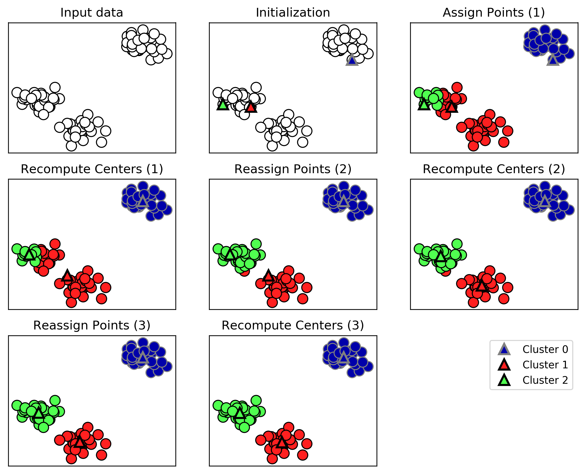

> Este material se basa en [Clustering con Python by Joaquín Amat Rodrigo](https://www.cienciadedatos.net/documentos/py20-clustering-con-python.html) 

# Pasos previos
Para este recorrido necesitarás las librerías [Pandas](https://pandas.pydata.org/), [Seaborn](https://seaborn.pydata.org/) y [Scikitlearn](https://scikit-learn.org/stable/index.html)

Podes corroborar si las tienes instaladas corriendo las siguientes líneas en tu intérprete de Python:

```python
import pandas as pd
import seaborn as sns
import sklearn
```

Si correr estas lineas no tira ningún error, etonces están felizmente instaladas las bibliotecas enc uestión. De lo contrario, obtendremos un mensaje de error `ModuleNotFoundError: No module named` al correr las lineas anteriores. En tal caso, podés instalar las bibliotecas desde la consola, con el comando:

```bash
        pip install pandas
        pip install seaborn
        pip install sklearn
```


# Guias de Trabajo
 * [1.Clustering ¿Qué es?](#1-Intro)
 * [2.Un ojo en el Iris](#1-Iris)
 * [3.Calculo de distancias](#3-distancia)
 * [4.Normalizado y escalado de los datos](#4-escalado)
 * [5.K-means](#5-kmeans)
 * [6.Evaluación del resultado obtenido](#6-inercia)

[1.Clustering ¿Qué es?](#1-Intro)


Hemos estado trabajando hasta aquí en la carga y limpieza da datos con Pandas. Es momento de comenzar a trabajar con los datos, analizarlos y poder encontrar patrones que nos permitan derivar información. El aprendizaje automático consiste en identificar de patrones o tendencias que de los datos de forma automática.

> Para pensar 🤔: ¿Qué utilidad le encontrás al aprendizaje automatizado? ¿Qué aplicaciones se te ocurren o conoces?


<details>
  <summary>Recurso audiovisuales complementarios</summary>

[Inteligencia Artificial: ¿Amiga o Enemiga? | Diego Fernández Slezak](https://www.youtube.com/watch?v=znq3ql6wqnE)

[¿De qué es capaz la inteligencia artificial? | DW Documental](https://www.youtube.com/watch?v=34Kz-PP_X7c&t=146s)
</details>

En este recorrido nos centraremos particularmente en métodos que nos permitan describir la estructura u organización de nuestros datos. Los métodos de clustering(agrupamientos) nos permiten buscar patrones "ocultos" en los datos sin la necesidad de contar con la información sobre la verdadera clasificación (etiquetas) de los datos. Son métodos exploratorios que agrupan los datos según similitud para simplificar su análisis.

> Para pensar 🤔: ¿Qué tipo de simplificaciones permite el agrupamiento de datos?

Existen una amplia cantidad de técnicas que nos permiten encontrar patrones en los datos y agruparlas de algún modo, pero en todos los casos estos agrupamientos se establecen de forma que, las observaciones que están dentro de un mismo grupo, son similares entre ellas y distintas a las de otros grupos. Todos los métodos de clustering requieren de la definición y cuantificación de la similitud entre las observaciones. Es por ello que resulta necesario revisar el concepto de distancia, ya que es lo que se usa como medida de similitud o diferencia entre grupos.


[2.Un ojo en el Iris](#2-Iris)


En este recorrido utilizaremos el [set de datos](https://github.com/flbulgarelli/recursos-python/blob/master/2_Ciencia_de_datos_pandas/iris_data.txt) [Iris](https://en.wikipedia.org/wiki/Iris_flower_data_set) que consiste en un conjunto de datos u observaciones realizadas por el biólogo Ronald Fisher, sobre las característica de distintas especies de plantas plantas. ¿Será posible clasificar las plantas utilizando alguno de estas observaciones que hizo Fisher?

Vamos a explorar los datos:

```python
import pandas as pd

iris = pd.read_csv(datapath + "iris/iris_hidden.txt", sep = '\t')
```


>  🧗‍♀️ Desafío I: Averiguá qué variables (columnas) tiene la tabla e inspecioná el DataFrame

Para tener una idea más intuitiva del "comportamiento" de los datos podemos graficar la distribución de frecuencias de las distintas variables que nos permitirá, por ejemplo,  saber si las observaciones son únicas o se repiten. Para ello utilizaremos la biblioteca [Seaborn](https://seaborn.pydata.org/):

```python
import seaborn as sns

g = sns.histplot(data = iris, x = "sepal.length", binwidth=0.25, kde = True)

```


> Para pensar 🤔: ¿Qué información obtenes del gráfico? 
>
> 🧗‍♀️ Desafío II: Grafica la distribución de frecuencias de la variable "petal.length" ¿Qué información obtenes del gráfico? ¿Qué diferencias notás respecto del observado para la variable sepal.length? 
>
> 🧗‍♀️ Desafío III: Grafica la distribución de frecuencias del resto de las variables.
>
> Para pensar 🤔: ¿Qué información pudiste obtener de observar las distribuciones de las distintas variables? ¿Cuántos tipos de plantas crees que existen?

Ahora que pudimos observar como se comportan las variables, nos puede ser de gran utilidad estudiar las asociaciones entre las mismas (correlación). De este modo sabremos si el comportamiento (crecimiento o disminución) de una variable, se debe o está influenciada por otra. Con los pairplots de seabron, podemos entonces estudiar si existen correlaciones entre las variables:


```python
import seaborn as sns

g = sns.pairplot(iris)

```
> 🧗‍♀️ Desafío IV: ¿Existe alguna correlación entre algunas de las variables? ¿Cómo te diste cuenta? 


[3.Calculo de distancias](#3-distancia)

Hemos observado las distribuciones de nuestros datos y la manera en que se correlacionan las variables, y de este modo comenzar a intuir posibles agrupamientos de los datos. Es decir, pudimos observar mediante gráficos exploratorios que algunos registros muestran una mayor similitud entre si.

Justamente, los métodos de clustering permiten la identificación automática de grupos en los que se pueden agrupar las observaciones de un conjunto de datos. Esto se hace de forma tal que las observaciones o registros asignados a un mismo grupo, muestren una mayor similitud entre sí que con los miembros de otros grupos. Pero, ¿Cómo medimos similitud entre miembros de un grupo dado? 🤔


Hagamos un prueba para intentar dar respuesta a esta pregunta. Tomemos, por ejemplo, un conjunto de emojis 🙀😻🥰😱😾🙊🙈😠
> Para pensar 🤔: ¿Cómo los agruparías/clasificarías?¿Se te ocurre más de una forma de clasificarlos?¿Qué criterios usaste para cada caso?

Como habrás observado, la clasificación de los datos es subjetiva, en tanto depende del modo en que decidimos medir la similitud entre las observaciones. Y tal como hemos visto, existen múltiples formas de calcular lasimilitud entre los datos. 

Una forma de obtener la similitud es asumir que los datos son puntos en el espacio, por lo que si se define la distancia ente los puntos y se mide la separación entre dos registros, podrá obtenerse la similitud entre estos. 

Una de las formas más básicas para calcular la **distancia**  entre dos puntos es la **Euclídea**, basada en el famoso [Teorema de Pitágoras](https://es.wikipedia.org/wiki/Teorema_de_Pit%C3%A1goras).. ¡Si, era importante Pitágoras!


¿Pero no todas las definiciones de distancia son aplicables a todos los tipos de datos no? ¡Claro que no! ¿Como por ejemplo...? 🤔


> Para pensar 🤔: ¿Qué otras formas de caluclar la distancia se te ocurren?
>
> 🧗‍♀️ Desafío V: Buscá otras formas de calcular la distancia entre las observaciones ¿Qué ventajas o desventajas encontras en cada forma de calcular las distancias?

[4.Normalizado y escalado de los datos](#4-escalado)

Ya hemos identificado las problemáticas a la hora de clasificar los datos, pero para que las comparaciones que hagamos sean completamente válidas, resulta de suma importancia hacer un tratamiento extra de los datos. 

Uno de los tratamientos necesarios es el escalado de los datos. Este procedimiento nos permite asegurarnos de que aún cuando algunas variables toman valores más grandes no se usarán como predictor principal a la hora de clasificar.


Veamos un ejemplo gráfico de esta problemática que estamos describiendo: 


Imaginemos que tenemos que analizar la trayectoria profesional de dos personas, para hacer una selección laboral. A priori, sería lógico pensar en basar esta selección en el curriculum de dichas personas. Sin embargo, resulta evidente que el curriculum no nos da un panaroma completo de las habilidades de una persona. Por ejemplo, no nos permite conocer su capacidad de trabajo en equipo o sus habilidades para realizar más de una tarea a la vez, etc. ¿Qué peso le estamos dando entonces a estas otras características? ¿Estamos subvalorando o sobrevalorando las hablidades de las personas? ¿Que pasa con las personas no tienen las mismas posibilidades para completar su curriculum? ¿Las hace menos capaces para el trabajo?

Es por ello que resulta necesario escalar los datos. La escala es importante para poder especificar que una modificación en una cantidad no es igual a otra modificación en otra. En pocas palabras, escalar los datos le da a todas las características la misma importancia para que ninguna esté dominada por otra. 

Ademas, resulta necesario antes de comenzar a clasificar nuestros datos es la normalización. Esta implica transformar o convertir el conjunto de datos en una distribución normal, de forma que todos datos tenga una varianza del mismo orden. De este modo, cada dato nos dará una idea de a cuántos desvíos de la media está ese punto.

Estas operaciones pueden hacerse muy fácilmente con la clase `StandardScaler`, del módulo `scikitlearn`:


```python
from sklearn.preprocessing import StandardScaler
scaler = StandardScaler()
iris_escaleado = scaler.fit_transform(iris)
```

[5.K-means](#5-kmeans)

Ahora que hemos normalizado y escalado nuestros datos podemos finalmente utilizar un método para agrupar nuestros datos. Vamos a utilizar el método K-means(MacQueen, 1967) que agrupa las observaciones en los mejores K grupos distintos, es decirlos k clusters con la menor varianza interna (intra-cluster variation) posible. Es decir que se reparten las observaciones en K clusters de forma que la suma de las varianzas internas de todos ellos sea lo menor posible. 

Podríamos decir que este método repite/itera una serie de pasos hasta que encuentra los mejores k grupos:



  1) Especifica el número K de clusters que se quieren crear

  2) Selecciona de forma aleatoria k observaciones del set de datos como centroides iniciales, esto es los datos a los cuáles se calcula la distancia para delimitar el grupo de menor varianza interna

  3) Calcula las distancia de todos los datos al centroide, para definir a cuál se encuentra más próximo

  4) Para cada uno de los K clusters recalcular su centroide, la posición del centroide se actualiza tomando como nuevo centroide la posición del promedio de las observaciones pertenecientes a dicho grupo

  5) Repete los pasos 3 y 4 hasta que los centroides no se mueven, o se mueven por debajo de una distancia umbral en cada paso, o se alcancen el número de iteraciones definidas de antemano.

Apliquemos ahora este método a nuestros datos:


```python
k = 3  #definimos la cantidad de clusters
kmeans = KMeans(n_clusters = k, init="random", n_init=10, max_iter=300, random_state=123457) #tomamos los centroides de forma aleatoria y definimos un máximo de 300 iteraciones
kmeans.fit(iris_escaleado)  #aplicamos el método a nuestros datos
```

La asignación de cada punto a un cluster se obtiene el atributo `labels_` del objeto `clusters`, esta propiedad me dice que etiqueta le puso a cada uno de mis datos. 


```python
print(kmeans.labels_)

```

Los centroides pueden ser obtenidos con `cluster_centers_`:

```python
print(kmeans.cluster_centers_ )

```

Para entender mejor los resultados obtenidos grafiquemos la distribución de puntos, pintando cada punto según el color correspondiente al etiquetado:


```python
colores = ["red", "green", "blue"]
g = sns.scatterplot(x = iris_escaleado[:,2], y = iris_escaleado[:, 3], hue = kmeans.labels_, palette = colores, alpha = 0.5)
g = sns.scatterplot(x = kmeans.cluster_centers_[:,2], y = kmeans.cluster_centers_[:,3], zorder = 10, palette = colores, hue = [0, 1, 2], legend = False, marker=6, s=200)
```

> Para pensar 🤔: ¿Es bueno o malo este resultado? ¿Cómo podríamos evaluar el resultado?
>


[6.Evaluación del resultado obtenido](#6-inercia)